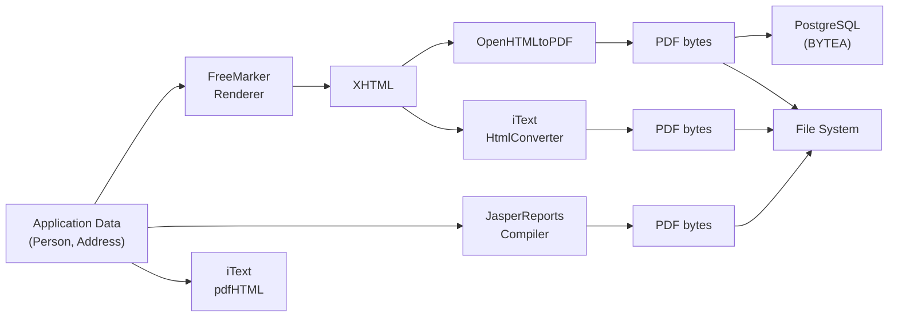
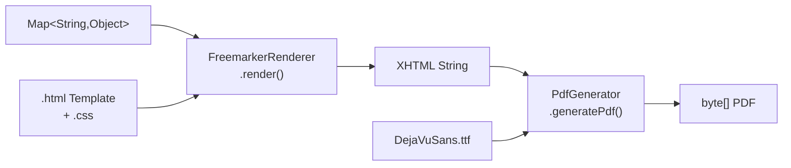

# print — Template-Based PDF Generation

A multi-module Java project comparing three PDF generation approaches, with a shared benchmark suite and database integration tests.

**Spring Boot 4.0.2 / Java 21**

## Modules

| Module | Description |
|---|---|
| [pdf-creation](pdf-creation/) | Core library: FreeMarker + OpenHTMLtoPDF |
| [pdf-creation-jasper](pdf-creation-jasper/) | Alternative: JasperReports |
| [pdf-creation-itext](pdf-creation-itext/) | Alternative: iText pdfHTML |
| [pdf-creation-db](pdf-creation-db/) | Database integration with PostgreSQL Testcontainers |
| [benchmark](benchmark/) | 10k-document comparison benchmark across all three engines |

## Dataflow



### Core Pipeline (pdf-creation)



## Benchmark Results (10,000 Documents)

Measured on Apple Silicon (M-series), Java 25, single-threaded. 100-document warmup excluded from steady-state metrics.

| Metric | FreeMarker+OHTPDF | JasperReports | iText pdfHTML |
|---|--:|--:|--:|
| **Total time** | 44.2s | 11.6s | 14.9s |
| **Throughput** | 226 PDFs/s | 860 PDFs/s | 670 PDFs/s |
| **Avg time per PDF** | 4.42ms | 1.16ms | 1.49ms |
| **Warmup (first PDF)** | 290ms | 466ms | 129ms |
| **Steady-state throughput** | 231 PDFs/s | 922 PDFs/s | 688 PDFs/s |
| **Peak heap memory** | 52 MB | 60 MB | 63 MB |
| **Total output size** | 161 MB | 244 MB | 44 MB |
| **Avg PDF file size** | 16.5 KB | 25.0 KB | 4.5 KB |
| **P50 latency** | 4.2ms | 1.0ms | 1.4ms |
| **P95 latency** | 5.6ms | 1.6ms | 1.9ms |
| **P99 latency** | 7.9ms | 2.9ms | 2.7ms |

### DB Benchmark (FreeMarker+OHTPDF + PostgreSQL)

10,000 PDFs generated from database records and stored back as BYTEA, using Testcontainers PostgreSQL 17.

| Metric | Result |
|---|--:|
| **Total time** | 47.3s |
| **Throughput** | 211 PDFs/s |
| **Avg time per PDF** | 4.73ms |
| **Steady-state avg** | 4.07ms |
| **Steady-state throughput** | 246 PDFs/s |
| **P50 latency** | 3.9ms |
| **P95 latency** | 5.5ms |
| **P99 latency** | 7.0ms |
| **Total output size** | 152 MB |
| **Avg PDF file size** | 15.5 KB |

## Quick Start

```java
// 1. Build your template model
Map<String, Object> model = new HashMap<>();
model.put("recipientName", "Hans Müller");
model.put("date", "18. Februar 2026");
model.put("showNotice", true);
model.put("noticeText", "Bitte beachten Sie die Änderungen.");

// 2. For QR codes, load a static image as base64 data URI
byte[] qrBytes = Files.readAllBytes(Paths.get("images/qr-code.png"));
String qrDataUri = "data:image/png;base64," + Base64.getEncoder().encodeToString(qrBytes);
model.put("qrCodeDataUri", qrDataUri);

// 3. Render HTML via FreeMarker
FreemarkerRenderer renderer = new FreemarkerRenderer();
String html = renderer.render("template-a", model);

// 4. Generate PDF
String baseUri = getClass().getClassLoader().getResource("").toExternalForm();
PdfGenerator pdfGenerator = new PdfGenerator();
byte[] pdf = pdfGenerator.generatePdf(html, baseUri);

// 5. Write to file or return as response
Files.write(Paths.get("output.pdf"), pdf);
```

## The Two Components

### `FreemarkerRenderer`

Renders a FreeMarker template with a variable map into an HTML string.

```java
FreemarkerRenderer renderer = new FreemarkerRenderer();
String html = renderer.render("template-name", model);
```

- Resolves templates from `classpath:templates/{name}.html`
- No Spring application context needed
- Returns fully rendered HTML (no FreeMarker directives remain)

### `PdfGenerator`

Converts an HTML string to a PDF byte array.

```java
PdfGenerator generator = new PdfGenerator();
byte[] pdf = generator.generatePdf(html, baseUri);
```

- `html` — rendered HTML string (must be well-formed XHTML)
- `baseUri` — base URI for resolving relative CSS/image paths. Use `getClass().getClassLoader().getResource("").toExternalForm()` to point to your classpath root
- Bundles DejaVuSans.ttf for full Unicode support (umlauts, special characters)

### QR Codes

QR codes are embedded as static PNG images rather than generated at runtime. Load a pre-generated QR code file and pass it as a base64 data URI in the template model:

```java
byte[] qrBytes = Files.readAllBytes(Paths.get("images/qr-code.png"));
String dataUri = "data:image/png;base64," + Base64.getEncoder().encodeToString(qrBytes);
model.put("qrCodeDataUri", dataUri);
```

## Converting Word Templates to HTML

Before you can use a Word template in this pipeline, you need to convert it to clean HTML once. The recommended online tool is **[WordHTML.com](https://wordhtml.com/)**.

### Why WordHTML.com

- Free, no signup required
- Drag-and-drop `.docx` upload
- View and edit the generated HTML source with syntax highlighting (CodeMirror)
- Cleanup buttons to strip Word cruft (inline styles, empty tags, classes, comments)
- Download result as `.html`
- Images embedded as base64 data URIs (works directly with OpenHTMLtoPDF)

### Conversion Workflow

1. **Upload** — drag your `.docx` file onto [wordhtml.com](https://wordhtml.com/)
2. **Clean** — click the cleanup buttons to remove inline styles, empty tags, and classes
3. **Switch to HTML tab** — review the source code
4. **Save** — download as `.html` or copy the source
5. **Add FreeMarker** — replace static text with `${variable}` expressions and `<#if>` directives
6. **Extract CSS** — move inline styles to a separate `.css` file with `@page` rules
7. **Fix XHTML** — self-close void elements (`<br/>`, ``, `<meta/>`)

### Alternative: Mammoth.js Demo

For the cleanest semantic output (headings, lists, tables — no styling), use the [Mammoth.js browser demo](https://jstool.gitlab.io/demo/mammoth-js-word-docx-preview-and-convert/). It runs entirely client-side (no upload to any server) and produces minimal HTML by mapping Word styles to semantic elements (`Heading 1` → `<h1>`, bold → `<strong>`). The tradeoff is that all visual styling is stripped — you write the CSS from scratch.

## How to Migrate a Jasper Template

### Step 1: Create the HTML Template

Convert your `.jrxml` layout to an XHTML file with FreeMarker placeholders:

```html
<?xml version="1.0" encoding="UTF-8"?>
<!DOCTYPE html>
<html xmlns="http://www.w3.org/1999/xhtml">
<head>
    <meta charset="UTF-8"/>
    <link rel="stylesheet" href="css/your-template.css"/>
</head>
<body>
    <h1>${title}</h1>
    <p>${bodyText}</p>

    <!-- Conditional blocks -->
    <#if showWarning>
    <div class="warning">
        <p>${warningText}</p>
    </div>
    </#if>

    <!-- QR code (static image as data URI) -->
    

    <!-- Page break for multi-page documents -->
    <div style="page-break-before: always;">
        <h2>Page 2 Content</h2>
    </div>
</body>
</html>
```

**Template rules:**
- Must be valid XHTML (self-close void elements: `<br/>`, ``, `<meta ... />`)
- Use `${variable}` for dynamic text, `<#if condition>` for conditional blocks
- Place in `src/main/resources/templates/` (or `src/test/resources/templates/` for tests)

### Step 2: Create the Print CSS

Create a matching CSS file for print layout:

```css
@page {
    size: A4;
    margin: 2.5cm 2cm;

    @top-center {
        content: "Company Name";
        font-family: 'DejaVuSans', sans-serif;
        font-size: 8pt;
        color: #666;
    }

    @bottom-center {
        content: "Seite " counter(page) " von " counter(pages);
        font-family: 'DejaVuSans', sans-serif;
        font-size: 8pt;
    }
}

body {
    font-family: 'DejaVuSans', sans-serif;
    font-size: 11pt;
}
```

Place CSS files in `src/main/resources/css/` (same classpath root as templates).

### Step 3: Map Jasper Parameters to Template Variables

| Jasper Concept | Replacement |
|---|---|
| `$P{paramName}` | `${paramName}` |
| `$F{fieldName}` | `${fieldName}` |
| `<band>` sections | HTML `<div>` elements |
| Subreports | Include via `<#include>` or inline |
| Conditional printing (`printWhenExpression`) | `<#if condition>` |
| Page header/footer | `@page { @top-center { ... } }` |
| Page break | `page-break-before: always` |
| Static text | Plain HTML text |
| Images | `` with `src="${variable}"` or inline `src` |
| Barcodes/QR | Static image file as base64 data URI |

### Step 4: Wire It Up

Replace your JasperReports fill+export code:

```java
// BEFORE (JasperReports)
JasperReport report = JasperCompileManager.compileReport("template.jrxml");
JasperPrint print = JasperFillManager.fillReport(report, parameters, dataSource);
byte[] pdf = JasperExportManager.exportReportToPdf(print);

// AFTER (this library)
FreemarkerRenderer renderer = new FreemarkerRenderer();
PdfGenerator pdfGenerator = new PdfGenerator();

Map<String, Object> model = new HashMap<>();
model.put("title", "Document Title");
model.put("bodyText", "Content here");

String html = renderer.render("your-template", model);
String baseUri = getClass().getClassLoader().getResource("").toExternalForm();
byte[] pdf = pdfGenerator.generatePdf(html, baseUri);
```

## CSS Constraints

OpenHTMLtoPDF implements **CSS 2.1**, not a full browser engine.

**Supported:** box model, `display: block/inline/table/table-cell`, `float`, `position: static/relative/absolute`, `@page` rules, `page-break-*`, `border-radius`, `background-color`, base64 data URIs, `@font-face`

**Not supported:** Flexbox, Grid, `calc()`, `var()`, `box-shadow`, `text-shadow`, media queries, viewport units, JavaScript

**Practical consequence:** Use `<table>` for multi-column layouts instead of Flexbox/Grid. See [CSS-CONSTRAINTS.md](CSS-CONSTRAINTS.md) for the full reference.

## Project Structure

```
pdf-creation/                  # Core: FreeMarker + OpenHTMLtoPDF
pdf-creation-jasper/           # Alternative: JasperReports
pdf-creation-itext/            # Alternative: iText pdfHTML
pdf-creation-db/               # PostgreSQL integration (Testcontainers)
benchmark/                     # 10k comparison benchmark
```

## Included Example Templates

### Template A — Business Letter (2 pages)

Variables: `recipientName`, `recipientStreet`, `recipientCity`, `date`, `subject`, `bodyText`, `showNotice`, `noticeText`, `qrCodeDataUri`, `senderName`, `termsText`, `showDisclaimer`, `disclaimerText`, `contactInfo`

### Template B — Product Information Sheet (1 page, 2 columns)

Variables: `title`, `subtitle`, `productName`, `productDescription`, `price`, `availability`, `contactPerson`, `phone`, `email`, `companyAddress`, `showSpecialOffer`, `specialOfferText`, `footerText`

Run `mvn test` to generate example PDFs in `target/test-output/`.
